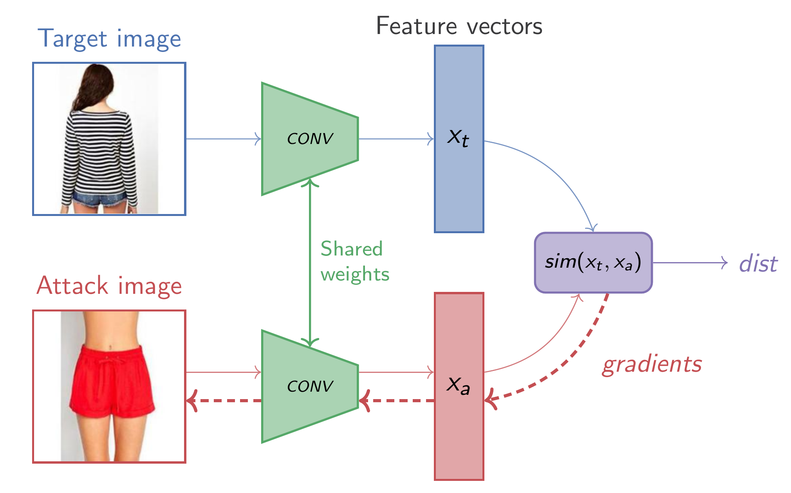
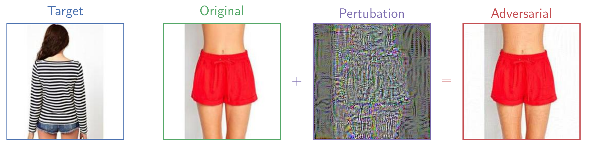
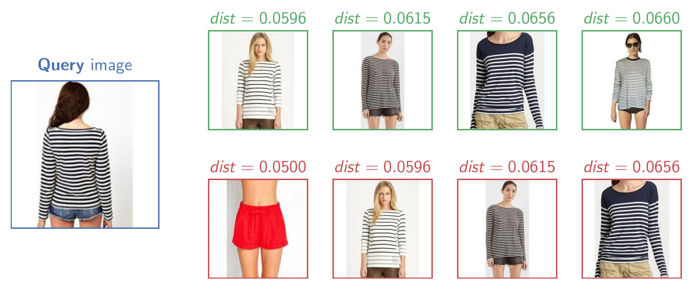
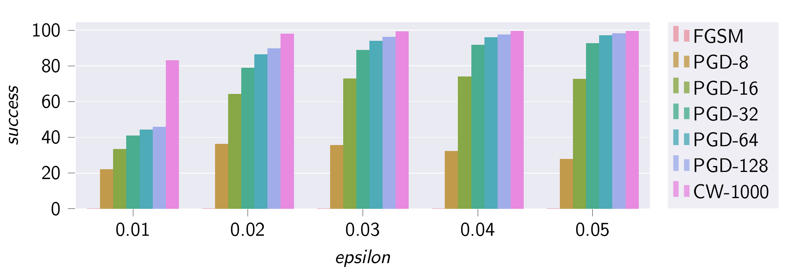
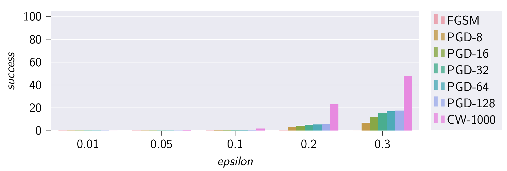

# Adversarial Recommender Systems

This repo contains the PyTorch implementation and LaTeX code for my master thesis, _Adversarial Attacks and Defenses for Image-Based Recommendation Systems using Deep Neural Networks_.

## Abstract
>Today recommendation systems (RSs) are an established part of modern web-services
and are deployed by numerous companies. Owing to the success of deep neural networks
(DNNs) in other domains, the industry has started implementing RSs using DNNs.
However, DNNs were shown to be vulnerable to targeted adversarial attacks in recent
studies. While there have been several studies on the subject of adversarial attacks
against collaborative filtering (CF) based RSs only few studies focusing on content-based
RSs have been published. In this thesis, we showed that a visual content-based RSs
using DNNs is vulnerable to targeted adversarial attacks using state-of-the-art white-box
attacks. In the next step, we tested different defense mechanisms utilizing adversarial
training (AT) and were able to show that AT had a significant positive impact on the
robustness of our trained models against our performed attacks.

- [Thesis 📕](doc/thesis/thesis.pdf) 
- [Slides 🎞️](doc/presentation/slides.pdf)

## Results
Proposed targeted **item-to-item attack setup** for an image based k-NN recommender
<p></p>

**Adversarial example**, created using PGD with ε=0.03 and 32 iterations
<p></p>

**Recommendation results** with injected PGD adversarial example
<p></p>

Attack success rates (%) for reaching a target rank <= 3 for an **undefended model**
<p></p>

Attack success rates (%) for reaching a target rank <= 3 for an **adversarially
trained model**
<p></p>

Attack success rates (%) for reaching a target rank <= 3 and ε=0.05 for **all evaluated attacks and defenses**
<table>
<thead>
  <tr style="border-top: 2px solid">
    <th style="border: none"></th>
    <th style="text-align: center" colspan="3">Attacks</th>
  </tr>
  <tr style="border-bottom: 1px solid">
    <td>Defenses</td>
    <td style="text-align: center">FGSM</td>
    <td style="text-align: center">PGD-128</td>
    <td style="text-align: center">CW-1000</td>
  </tr>
</thead>
<tbody>
  <tr>
    <td>Unsecured</td>
    <td style="text-align: center">0.07</td>
    <td style="text-align: center">98.32</td>
    <td style="text-align: center">99.70</td>
  </tr>
  <tr>
    <td>AT</td>
    <td style="text-align: center">0.03</td>
    <td style="text-align: center">0.07</td>
    <td style="text-align: center">0.30</td>
  </tr>
  <tr style="border-bottom: 2px solid">
    <td>CAT</td>
    <td style="text-align: center">0.00</td>
    <td style="text-align: center">14.89</td>
    <td style="text-align: center">32.80</td>
  </tr>
</tbody>
</table>
<br>

## Intallation
To install all required dependencies a script for debian based distros is included
```bash
./setup.sh
```
for other distros or operating systems you need to install Python 3.7 and Pipenv manually

## Downloading and data preprocessing

```bash
./data.sh
```
## Training a normal model
```bash
pipenv run python -m src.train --batch-size 32 normal --num-epochs 12
```
## Training a model using adversarial training
```bash
pipenv run python -m src.train --batch-size 32 adversarial --num-epochs 12
```
## Training a model using curriculum adversarial training
```bash
pipenv run python -m src.train --batch-size 32 curriculum-adversarial --num-epochs 12
```
## Evaluating all models
```bash
./evaluate.sh
```
## Attacking all models
```bash
./attack.sh
```

## Attacking a single model using FGSM
```bash
pipenv run python -m src.attack --model-name normal-24-epochs --epsilon 0.03 fgsm
```
## Attacking a single model using PGD
```bash
pipenv run python -m src.attack --model-name normal-24-epochs --epsilon 0.03 pgd
```
## Attacking a single model using CW
```bash
pipenv run python -m src.attack --model-name normal-24-epochs --epsilon 0.03 cw
```
## Cite

```BibTeX
@mastersthesis{normann2020advrecsys,
  title={Adversarial Attacks and Defenses for Image-Based Recommendation Systems using Deep Neural Networks},
  author={Philipp Normann},
  year={2020}
}
```
